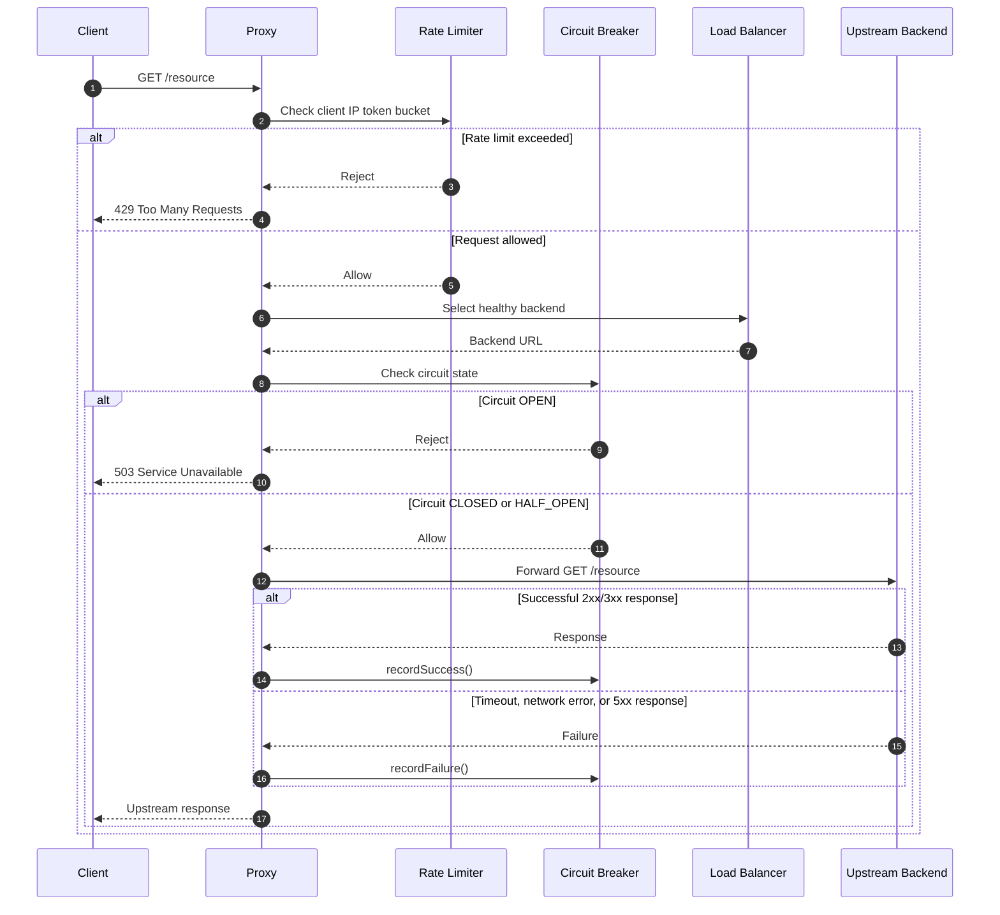

# Resilient Reverse Proxy

An SRE-focused reverse proxy built with Spring Boot and Java 21. The project demonstrates practical resilience patterns
for protecting and routing traffic to upstream services:

- **Circuit Breaker**: isolates failing backends and returns `503 Service Unavailable` while a backend circuit is open.
- **Rate Limiter**: applies an in-memory token bucket limit per client IP to protect the proxy from excessive traffic.
- **Load Balancer**: distributes requests across configured upstream backends while temporarily skipping unhealthy
  nodes.
- **Health Checks**: probes each backend every five seconds and updates node availability based on `/health` responses.
- **Metrics**: exposes request, rate-limit, and circuit-breaker rejection counters through a JSON endpoint.

## Features

- Per-backend circuit breakers with `CLOSED`, `OPEN`, and `HALF_OPEN` states.
- Configurable per-IP rate limiting using the token bucket algorithm.
- Thread-safe upstream registry with round-robin routing.
- Asynchronous health checks using a dedicated thread pool.
- Automatic backend recovery when health checks succeed again.
- Native Java `HttpClient` forwarding with request timeout handling.
- Structured `INFO` and `WARN` logging through Lombok `@Slf4j`.
- Docker and Docker Compose support for local integration testing.
- Runtime configuration through Spring `@ConfigurationProperties`.

## Quick Start

### Prerequisites

- Docker Engine with Docker Compose v2
- A shell capable of running Bash scripts

### Start the stack

From the project root:

```bash
./run.sh
```

The launcher builds the application image and starts the complete Compose stack:

| Service    | Host address            | Purpose                 |
|------------|-------------------------|-------------------------|
| `proxy`    | `http://localhost:8080` | Resilient reverse proxy |
| `backend1` | `http://localhost:8081` | Mock upstream backend   |
| `backend2` | `http://localhost:8082` | Mock upstream backend   |

You can also start the stack directly:

```bash
docker compose up --build
```

To stop the services:

```bash
docker compose down
```

## Configuration

Default application configuration is defined in `src/main/resources/application.yml`:

```yaml
proxy:
  backends:
    - http://localhost:8081
    - http://localhost:8082
  rate-limit-per-minute: 100
```

Docker Compose overrides the backend URLs so the proxy can reach the containers over the Compose network:

```yaml
environment:
  PROXY_BACKENDS: http://backend1:5678,http://backend2:5678
  PROXY_RATE_LIMIT_PER_MINUTE: 100
```

## API Usage

### Proxy a request

Forward a GET request through the proxy to one of the configured upstream services:

```bash
curl http://localhost:8080/
```

The load balancer selects a healthy backend using round-robin routing. Additional paths and query strings are forwarded:

```bash
curl "http://localhost:8080/hello?name=operator"
```

If the selected backend circuit is open, the proxy responds immediately with:

```http
HTTP/1.1 503 Service Unavailable
```

If a client IP exceeds the configured token bucket limit, the rate limiter responds with:

```http
HTTP/1.1 429 Too Many Requests
```

### Read metrics

Retrieve the current in-memory counters:

```bash
curl http://localhost:8080/metrics
```

Example response:

```json
{
  "total_requests": 12,
  "rate_limited_requests": 0,
  "circuit_breaker_rejections": 0
}
```

The counters represent:

- `total_requests`: requests that passed through the rate-limit filter.
- `rate_limited_requests`: requests rejected with HTTP `429`.
- `circuit_breaker_rejections`: requests rejected with HTTP `503` because the selected backend circuit was open.

## Request Flow



## Project Structure

```text
src/
  main/
    java/com/doublespy/resilientreverseproxy/
      CircuitBreaker.java
      HealthCheckDaemon.java
      MetricsController.java
      MetricsService.java
      ProxyConfig.java
      ProxyController.java
      RateLimiter.java
      RateLimitFilter.java
      UpstreamRegistry.java
    resources/application.yml
Dockerfile
docker-compose.yml
run.sh
```

## Development

Run the test suite with the Maven Wrapper:

```bash
./mvnw test
```

The project targets Java 21 and uses Spring Boot, Spring Web, Spring Actuator, JUnit 5, Mockito, and Lombok.
