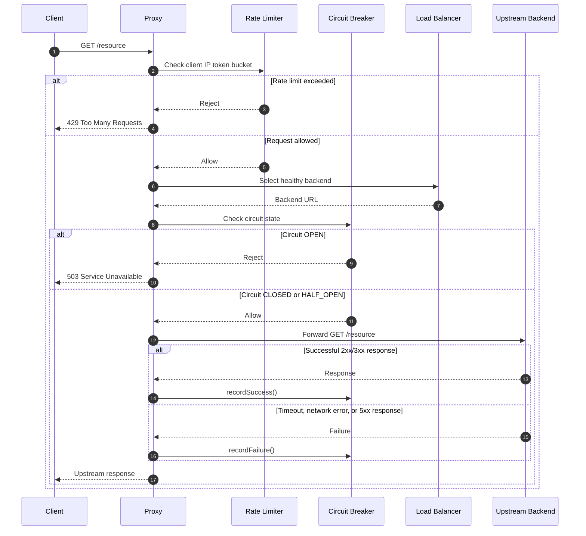

# Resilient Reverse Proxy

[](https://github.com/Doublespy8971/resilient-reverse-proxy/actions/workflows/ci.yml)

An SRE-focused reverse proxy built with Spring Boot and Java 21. The project demonstrates practical resilience patterns
for protecting and routing traffic to upstream services:

- **Circuit Breaker**: isolates failing backends and returns `503 Service Unavailable` when no eligible backend is available.
- **Rate Limiter**: applies an in-memory token bucket limit per client IP to protect the proxy from excessive traffic.
- **Load Balancer**: distributes requests across configured upstream backends while temporarily skipping unhealthy
  nodes.
- **Health Checks**: probes each backend every five seconds and excludes nodes that return 5xx responses or cannot be reached.
- **Metrics**: exposes the existing JSON metrics endpoint and Prometheus metrics through Spring Actuator.

## Features

- Per-backend circuit breakers with `CLOSED`, `OPEN`, and `HALF_OPEN` states.
- Configurable per-IP rate limiting using the token bucket algorithm.
- Thread-safe upstream registry with round-robin routing.
- Asynchronous health checks using a dedicated thread pool.
- Backend re-entry after a successful health check, subject to the circuit state.
- Native Java `HttpClient` forwarding with request timeout handling.
- Structured `INFO` and `WARN` logging through Lombok `@Slf4j`.
- Docker and Docker Compose support for local integration testing.
- Runtime configuration through Spring `@ConfigurationProperties`.

## Quick Start

### Prerequisites

- Docker Engine with Docker Compose v2
- A shell capable of running Bash scripts

### Start the stack

From the project root:

```bash
./run.sh
```

The launcher builds the application image and starts the complete Compose stack:

| Service    | Host address            | Purpose                 |
|------------|-------------------------|-------------------------|
| `proxy`    | `http://localhost:8080` | Resilient reverse proxy |
| `backend1` | `http://localhost:8081` | Mock upstream backend   |
| `backend2` | `http://localhost:8082` | Mock upstream backend   |

You can also start the stack directly:

```bash
docker compose up --build
```

To stop the services:

```bash
docker compose down
```

## Configuration

Default application configuration is defined in `src/main/resources/application.yml`. Spring Boot maps the
environment variables shown by Docker Compose to the corresponding `proxy.*` properties.

| Property | Default | Description |
|---|---|---|
| `spring.application.name` | `resilient-reverse-proxy` | Application name |
| `proxy.backends` | `http://localhost:8081`, `http://localhost:8082` | Ordered backend URLs |
| `proxy.rate-limit-per-minute` | `100` | Token bucket capacity and refill rate per client IP |
| `proxy.failure-threshold` | `3` | Consecutive backend failures before opening a circuit |
| `proxy.open-delay` | `10s` | Time a circuit remains open before a probe is allowed |
| `proxy.trust-forwarded-headers` | `false` | Whether trusted proxy addresses may supply the client IP |
| `proxy.trusted-proxies` | `[]` | Remote addresses allowed to supply `X-Forwarded-For` |
| `management.endpoints.web.exposure.include` | `health,info,prometheus` | Actuator endpoints exposed over HTTP |
| `management.server.port` | `9090` | Local-only port for Actuator endpoints |
| `management.server.address` | `127.0.0.1` | Address bound by the Actuator server |

In Docker Compose, `PROXY_BACKENDS` is set to `http://backend1:5678,http://backend2:5678` and
`PROXY_RATE_LIMIT_PER_MINUTE` is set to `100`.

## API Usage

### Proxy a request

Forward a GET request through the proxy to one of the configured upstream services:

```bash
curl http://localhost:8080/
```

The load balancer selects a healthy backend using round-robin routing. Additional paths and query strings are forwarded:

```bash
curl "http://localhost:8080/hello?name=operator"
```

If the selected backend circuit is open, the proxy responds immediately with:

```http
HTTP/1.1 503 Service Unavailable
```

If a client IP exceeds the configured token bucket limit, the rate limiter responds with:

```http
HTTP/1.1 429 Too Many Requests
```

### Read metrics

Retrieve the current in-memory counters:

```bash
curl http://localhost:8080/metrics
```

Example response:

```json
{
  "total_requests": 12,
  "rate_limited_requests": 0,
  "circuit_breaker_rejections": 0
}
```

The counters represent:

- `total_requests`: requests that passed through the rate-limit filter.
- `rate_limited_requests`: requests rejected with HTTP `429`.
- `circuit_breaker_rejections`: requests rejected with HTTP `503` because the selected backend circuit was open.

Prometheus metrics are available at `http://localhost:9090/actuator/prometheus`. The exposed Actuator endpoints
are limited to `health`, `info`, and `prometheus`. Prometheus includes request counters tagged by backend and status class,
request duration percentile histograms, per-backend circuit and health gauges, and rate-limit/circuit-rejection
counters.

## Failure scenarios

- **Backend dies:** the five-second health checker marks an unreachable backend unhealthy. Routing skips it when
  another healthy backend is available. A request that encounters a connection failure also tries the next eligible
  backend.
- **Circuit opens:** a backend 5xx response or connection failure increments that backend's failure count. After
  three consecutive failures, its circuit becomes `OPEN`; routing excludes it and returns `503` if no eligible
  backend remains.
- **Half-open probe:** after the configured open delay, the circuit permits one probe. A successful response closes
  the circuit; another failure reopens it.
- **Recovery:** a backend that returns a non-5xx response to a later `/health` check is marked healthy again. It can
  receive traffic once its circuit is closed or eligible for a half-open probe.

## Known limitations

- Only `GET` requests are proxied; request bodies and other HTTP methods are not supported.
- Rate-limit buckets, health state, circuit state, and metrics are held in memory and are lost on restart.
- The proxy is a single-instance service; there is no shared state or coordination across replicas.
- Health checks use each backend's `/health` endpoint and treat any non-5xx response as healthy.

## Load test results

Run the k6 scenario and follow the timed backend stop/restart procedure in
[`loadtest/README.md`](loadtest/README.md). Replace the placeholders below with the measured values.

| Metric | Result |
|---|---|
| Throughput | TBD (not measured yet) |
| p50 latency | TBD (not measured yet) |
| p95 latency | TBD (not measured yet) |
| p99 latency | TBD (not measured yet) |
| Error rate during failover | TBD (not measured yet) |
| Time to recover after backend restart | TBD (not measured yet) |

## Request Flow



## Project Structure

```text
src/
  main/
    java/com/doublespy/resilientreverseproxy/
      CircuitBreaker.java
      HealthCheckDaemon.java
      MetricsController.java
      MetricsService.java
      ProxyConfig.java
      ProxyController.java
      RateLimiter.java
      RateLimitFilter.java
      UpstreamRegistry.java
    resources/application.yml
Dockerfile
docker-compose.yml
run.sh
```

## Development

Run the test suite with the Maven Wrapper:

```bash
./mvnw test
```

The project targets Java 21 and uses Spring Boot, Spring Web, Spring Actuator, JUnit 5, Mockito, and Lombok.
